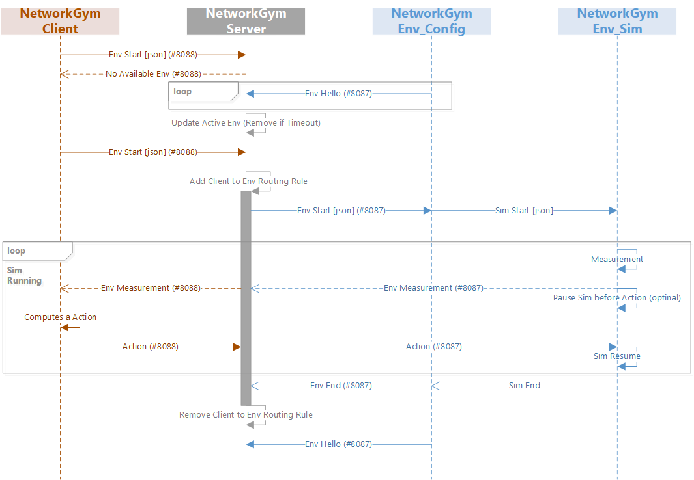

# network_gym_env


```{mermaid}
flowchart LR

subgraph network_gym_env
southbound_api[[southbound Interface]]
simulator
emulator
testbed 
end

```

NetworkGymEnv includes the two components, a **southbound interface**, and a **NetworkGym simulator**.
- The **southbound interface** connects the env to the server, receives the environment parameters, communicate network stats and policy between env and server.
- At present, we only support **NetworkGym simulator**. The emulator and testbed option will be released in the future.


```{note}
TODO: provide southbound interface example code
```
## NetworkGym UML Class Diagram
