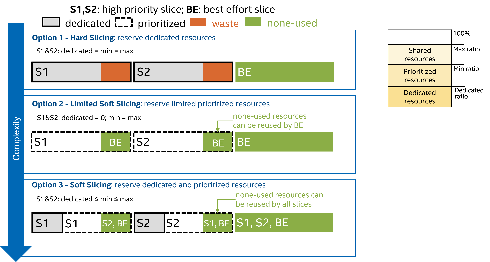

(cards-mx-cellular-slicing)=
# Cellular Network Slicing



In the Cellular Network Slicing environment, the entire network is partitioned into multiple slices, each tailored to serve distinct user groups. Utilizing its perceptive observations, the agent possesses the ability to allocate network resources, like resource blocks, to each slice with great efficiency.

Within each slice, the agent can designate resources as dedicated, prioritized, or shared as needed. Meanwhile, for users belonging to the same slice, the Cellular MAC scheduler implements the proportional fair algorithm, guaranteeing an equitable and impartial distribution of resources among them.

| | |
| ----- | ---- |
| Observation Space |  `Box(0.0, Inf, (5, N,), float32)` |
| Action Space | `Box(0.0, 1.0, (N,), float32)`  |
| Arguments | [config.json](https://github.com/IntelLabs/networkgym/network_gym_client/envs/network_slicing/config.json)  |
| Select Environment | `config_json = load_config_file('network_slicing')` <br> `env = NetworkGymEnv(client_id, config_json)`  |

## Description

In the Network Slicing environment, resource scheduling poses as a challenge, with multiple slices competing for the network's finite resources. The primary objective of resource scheduling is to strategically allocate these resources among slices using dedicated, prioritized, and shared resources, all while striving to meet the service level agreements for each slice.

## Prerequisite

Ensure that you have access to the NetworkGym Server on [vLab](https://registration.intel-research.net/) machines and have downloaded the [NetworkGymClient](https://github.com/IntelLabs/networkgym).

## Observation Space

The observation space is represented by a multidimensional array (`ndarray`) with a shape of `(5, N)`, where each of the `N` slices contains five distinct features:
1. **Total Throughput**: This measures the total data rate for each slice in Mbps, ranging from `0` to `Inf`.
2. **Resource Block Usage Rate**: It represents the fraction of resource blocks utilized by each slice, expressed as a percentage in the range of `[0, 1]`, with the sum across all slices equal to 1.
3. **Average Delay Violation Rate**: Initially measured user-wise and then averaged for each slice, this rate indicates the average proportion of delay violations, expressed as a percentage in the range of `[0, 1]`.
4. **Maximum Delay**: This records the maximum delay experienced by a slice at a specific moment, expressed in milliseconds and ranging from `0` to `Inf`.
5. **Average Delay**: It computes the average delay experienced by a slice, expressed in milliseconds and ranging from `0` to `Inf`.

| Feature | Observation | Min | Max |
| --- | --- | --- | --- |
| 0 | Total Throughput per slice (mbps) | 0.0 | Inf |
| 1 | Resource Block Usage Rate per slice | 0.0 | 1.0 |
| 2 | Average Delay Violation Rate per slice | 0.0 | 1.0 |
| 3 | Maximum Delay per slice (ms) | 0.0 | Inf |
| 4 | Average Delay per slice (ms) | 0.0 | Inf |

````{Note}
```{eval-rst}
The Observation Space can be customized in the :meth:`network_gym_client.envs.network_slicing.Adapter.get_observation` function.
```
````

```{tip}
The Observation Space can be normalized using the [NormalizeObservation](https://gymnasium.farama.org/_modules/gymnasium/wrappers/normalize/#NormalizeObservation) wrapper.
```

## Action Space

The action space is an `ndarray` with a shape of `(N,)`, indicating the allocation of resource blocks to `N` slices. It is important to note that the sum of the actions in this allocation should not exceed one. In case the sum surpasses one, the actions will be appropriately scaled down using the softmax function to ensure adherence to the constraint. This can be expressed mathematically as follows:
```{eval-rst}
if :math:`\sum_{i=1}^{N}a_i > 1, \quad a_i = \frac{e^{a_i}}{\sum_{j}e^{a_j}}.`
```

| Num | Action | Min | Max |
| --- | --- | --- | --- |
| 0 | Prioritized Rb allocated to slice 0 | 0.0 |  1.0 |
| 1 | Prioritized Rb allocated to slice 1 | 0.0 | 1.0 |
| ... |  |  | |
| N | Prioritized Rb allocated to slice N | 0.0 | 1.0 |

```{tip}
The Action Space can be rescaled using the [RescaleAction](https://gymnasium.farama.org/_modules/gymnasium/wrappers/rescale_action/) wrapper.
```

## Reward

The reward function in our system takes into account three factors: throughput, delay violation rate, and resource cost. It is formulated as follows:

```{eval-rst}
:math:`R(t) = \sum_{i = 1}^N \left( \frac{{\text{throughput}_i}}{{\text{load}_i}} - \lambda \cdot \text{delay_violation_rate}_i - \gamma \cdot \text{rb_usage_rate}_i \right)`
```

```{eval-rst}
In this formulation, we can adjust the emphasis given to the delay violation rate and the resource block usage rate using the parameters (:math:`\lambda`) and (:math:`\gamma`) respectively. By default, (:math:`\lambda=1.5`) and (:math:`\gamma = 0.5`), which prioritize delay considerations.
```

````{Note}
```{eval-rst}
The Reward can be customized in the :meth:`network_gym_client.envs.network_slicing.Adapter.get_reward` function.
```
````

## Arguments

All the network configurable parameters are defined in the JSON files. When the client starts, the JSON files will be loaded and transmitted to the server to configure the environment.
See the [NetworkGymClient](https://github.com/IntelLabs/networkgym#%EF%B8%8F-configurable-file-format) for more details.

## Starting State
The position of the users is assigned by a uniform random value in a 2D plane with configurable (x, y) boundaries. The starting velocity of the users and other parameters can also be configured in the JSON file.

## Episode End
A NetworkGym environment operates for a specified number of episodes, denoted as episodes_per_session (E), and each episode is truncated after a certain number of time steps, denoted as steps_per_episode (L). Resulting in E*L time steps per environment session. Both E and L can be customized through JSON configuration files.
The episode ends if either of the following happens:
1. Truncation: The length of each episode is L steps. Once an episode is truncated, the environment continues to run, generating results for the subsequent episode. It’s important to note that the environment parameters cannot be reconfigured after the end of a truncated episode.
2. Termination: The environment terminates after E episodes. At this point, the agent has the option to reconfigure the environment to continue training or to exit the program entirely.

```{tip}
See [Handling Time Limits](../../tutorials/handling_time_limits.md) for more details about Episode End.
```