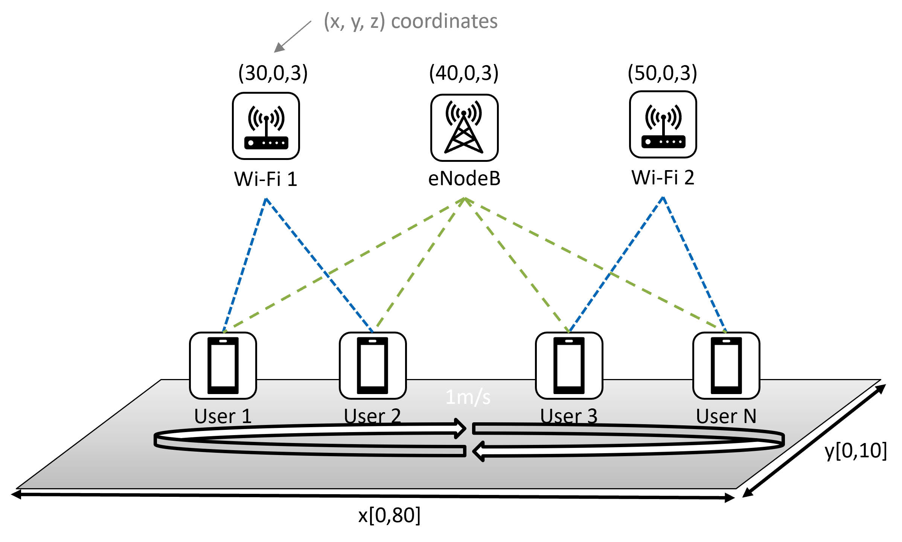

(cards-mx-traffic-splitting)=
# Multi-Access Traffic Splitting



The Multi-Access (MX) Traffic Splitting environment is part of the multi-access traffic management environments and provides general information about the environment.
In this environment, the agent performs periodic actions to update the traffic split ratio for each user, considering both Wi-Fi and LTE connections.

| | |
| ----- | ---- |
| Observation Space | `Box(0, Inf, (3, N,), float32)`  |
| Action Space |  `Box(0.0, 1.0, (N,), float32)`  |
| Arguments | [config.json](https://github.com/IntelLabs/networkgym/network_gym_client/envs/nqos_split/config.json)  |
| Select Environment | `config_json = load_config_file('nqos_split')` <br> `env = NetworkGymEnv(client_id, config_json)`  |

## Description

The Multi-Access (MX) Traffic Splitting environment represents a traffic management problem where multiple users are randomly distributed on a 2D plane, with each user connecting to a Cellular base station and the closest Wi-Fi access point. The handover between Wi-Fi access point is disabled.
 The goal of traffic management is to strategically split traffic over both links, aiming to achieve high throughput and low latency.

## Prerequisite

Ensure that you have access to the NetworkGym Server on [vLab](https://registration.intel-research.net/) machines and have downloaded the [NetworkGymClient](https://github.com/IntelLabs/networkgym).

## Observation Space

The observation is an `ndarray` with shape `(3,N,)` representing three features for N users. The first feature is MAX LTE rate, representing the user's estimation of channel capacity (e.g., the max rate if the user utilizes all resources). The second feature is the Max Wi-Fi rate, and the third feature is the received throughput, combining both links.

| Feature | Observation | Min | Max |
| ----- | ---- | ----- | ---- |
| 0 | MAX LTE rate (mbps) | 0.0 | Inf |
| 1 | MAX Wi-Fi rate  (mbps) | 0.0 | Inf |
| 2 | throughput (mbps) | 0.0 | Inf|


````{Note}

```{eval-rst}
The Observation Space can be customized in the :meth:`network_gym_client.envs.nqos_split.Adapter.get_observation` function.
```
See [Customizing Observation and Reward](../../tutorials/customizing_observation_and_reward.md) for more details.
````

```{tip}
The Observation Space can be normalized using the [NormalizeObservation](https://gymnasium.farama.org/_modules/gymnasium/wrappers/normalize/#NormalizeObservation) wrapper.
```

## Action Space
The action space is a `ndarray` with shape `(N,)` representing the traffic ratio over Wi-Fi for N users. The traffic ratio over Cellular equals (1.0 - action).

| Num | Action | Min | Max |
| ----- | ---- | ----- | ---- |
| 0 | Wi-Fi traffic ratio for user 0 | 0.0 | 1.0 |
| 1 | Wi-Fi traffic ratio for user 1| 0.0 | 1.0 |
| ... | | | |
| N-1 | Wi-Fi traffic ratio for user N-1| 0.0 | 1.0 |

```{tip}
The Action Space can be rescaled using the [RescaleAction](https://gymnasium.farama.org/_modules/gymnasium/wrappers/rescale_action/) wrapper.
```

## Transition Dynamics
Given an action (Wi-Fi split ratio for user i: R[i]), transmitter i follows the following transition dynamics:
- transmit R[i] traffic over Wi-Fi link.
- transmit (1-R[i]) traffic over LTE link.

## Reward

```{eval-rst}
We compute a utility function :math:`f = 0.5 \times log(throughput)-0.5 \times log(OWD)` using the reward function :meth:`network_gym_client.envs.nqos_split.Adapter.netowrk_util`, where OWD is the one-way delay.
The goal of the utility function is to maximize the throughput and minimizing delay.
```

````{Note}

```{eval-rst}
The Reward can be customized in the :meth:`network_gym_client.envs.nqos_split.Adapter.get_reward` function.
```
See [Customizing Observation and Reward](../../tutorials/customizing_observation_and_reward.md) for more details.
````

## Arguments

All the network configurable parameters are defined in the JSON files. When the client starts, the JSON files will be loaded and transmitted to the server to configure the environment.
See the [NetworkGymClient](https://github.com/IntelLabs/networkgym#%EF%B8%8F-configurable-file-format) for more details.

## Starting State
The position of the users is assigned by a uniform random value in a 2D plane with configurable (x, y) boundaries. The starting velocity of the users and other parameters can also be configured in the JSON file.

## Episode End
A NetworkGym environment operates for a specified number of episodes, denoted as episodes_per_session (E), and each episode is truncated after a certain number of time steps, denoted as steps_per_episode (L). Resulting in E*L time steps per environment session. Both E and L can be customized through JSON configuration files.
The episode ends if either of the following happens:
1. Truncation: The length of each episode is L steps. Once an episode is truncated, the environment continues to run, generating results for the subsequent episode. It’s important to note that the environment parameters cannot be reconfigured after the end of a truncated episode.
2. Termination: The environment terminates after E episodes. At this point, the agent has the option to reconfigure the environment to continue training or to exit the program entirely.

```{tip}
See [Handling Time Limits](../../tutorials/handling_time_limits.md) for more details about Episode End.
```